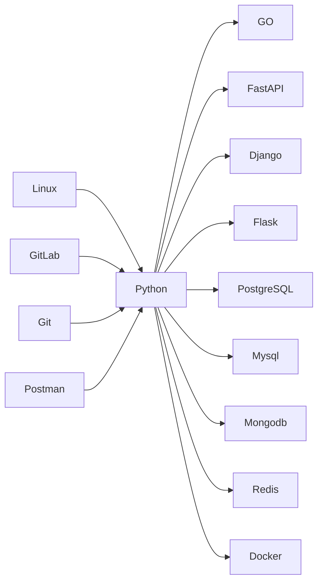

        

## 

  

# <h1 align="center"> Привет, я Владислав - Backend-разработчик </h1>

 

  Привет, мир! Я программист из Москвы, специализирующийся на разработке на Python. У меня есть опыт работы со многими инструментами. Я постоянно стремлюсь расширять свои знания и умения, открыт к сотрудничеству и всегда в поиске новых вызовов. Моя цель - развитие в области веб-разработки, участие в значимых проектах и обмен опытом с профессиональным сообществом - вместе мы сможем добиться большего!

 

## Спросите меня о

- Разработка backend (Python, GO, Rust, Django, FastAPI)
- Базы данных (PostgreSQL, MongoDB)
- DevOps (Linux, Docker, Git)
- Создание Telegram ботов
- AI технологии (агенты)

## Увлечения

- Философия (античная и современная)
- Путешествия (хочу увидеть весь шар)
- Искусство(живопись, кино, музыка)
- Видеоигры (стратегии и RPG)
- Разведение элитных пород собак

## Текущие проекты

- **PustoGames** - Геймификация
- **AI Startup project** [WIP] - В поисках вдохновения
- **Magnum opus** [WIP] - Тайное оружие

## Изучаю

- Python
- GO
- Django
- FastAPI
- API веб-сервисов
- ORM технологии
- Frontend

## 

<h1 align="center">

## 
Стек

  Я работаю с различными технологиями и инструментами, вот некоторые из них:

 

  
  
  
  
  
  
  
  
  
  
  
  
  
  

 

  

 

## 

<picture>
  <source media="(prefers-color-scheme: dark)" srcset="https://raw.githubusercontent.com/holic-x/holic-x/output/github-contribution-grid-snake-dark.svg">
  <source media="(prefers-color-scheme: light)" srcset="https://raw.githubusercontent.com/holic-x/holic-x/output/github-contribution-grid-snake.svg">
  
</picture>

## 

## 
Связь со мной

  
Если у вас есть вопросы или предложения, не стесняйтесь связаться со мной:

  <table>
    <tr>
      <td align="center">
        
      </td>
      <td align="center">
        
      </td>
    </tr>
  </table>

## 

  

## 

        

